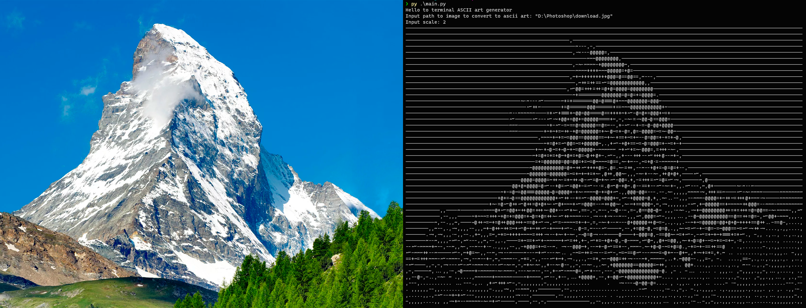

# Ascii art generator
Simple CLI Ascii art generator



# Prerequisites

1. [Python](https://python.org) version 3.6 or later
2. pip or pip3

# Run locally
1. Clone this repo

    ```shell
    git clone https://github.com/kill-your-soul/ascii-art-generator.git
    ```

2. Create virtual environment

    - For Windows:

        ```Powershell
        python -m venv .venv
        ```

    - For Linux, MacOS:

        ```shell
        python3 -m venv .venv
        ```

3. Activate virtual environment

    - For Windows:
    
        ```Powershell
        .\.venv\Scripts\activate
        ```

    - For Linux, MacOS:

        ```shell
        source ./.venv/bin/activate
        ```

4. Install requirements

    - For Windows:

        ```shell
        pip install -r requirements.txt
        ```

    - For Linux, MacOS:
    
        ```shell
        pip3 install -r requirements.txt
        ```

5. Run Script

    - For Windows:

        ```Powershell
        python main.py
        ```

    - For Linux, MacOS

        ```shell
        python3 main.py
        ```
